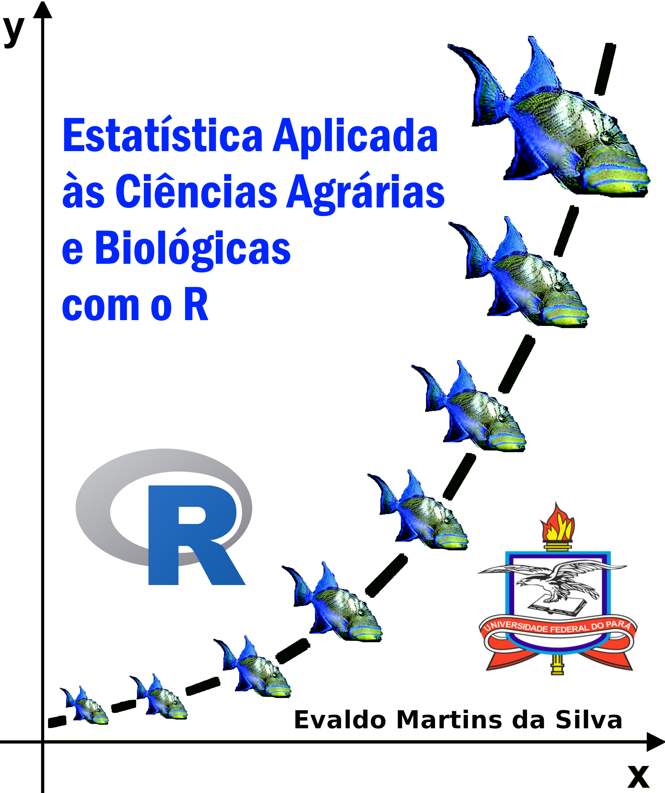

<!-- README.md is generated from README.Rmd. Please edit that file -->

```{r, include = FALSE}
knitr::opts_chunk$set(
  collapse = TRUE,
  comment = "#>",
  fig.path = "man/figures/README-",
  out.width = "40%"
)
```

# laquipedados

<!-- badges: start -->

<!-- badges: end -->

O objetivo deste repositório é servir de base para o livro ***Estatística Aplicada às Ciências Agrárias e Biológicas com R,*** fornecendo uma série de dados. Você pode baixá-los para serem usados em determinada análise presente em um capítulo do livro. Todos esses dados são de pesquisas próprias ou de autores que gentilmente os cederam ou autorizaram seus usos.

```{r cars, echo=FALSE}

```

## Exemplo de carregamento de dados

Você pode carregar os conjunto de daos deste pacote com os comandos abaixo:

```{r exemple, warning= FALSE, message = FALSE}
library(readr)
library(dplyr)
url = "https://raw.githubusercontent.com/Evaldo-Martins-STAT/laquipedados/master/"
arq <- "dados/aquifero.csv"
dados <- read_csv(paste0(url, arq), col_types = 'fdddddf')
# glimpse(dados)
```

-   Exibição dos dados de sua análise

```{r, warning=F, message= F}
library(kableExtra)
kable(head(dados))
```

Sempre que possível, observe os tipos de variáveis que vc está usando, pois isso é importante para os testes estatísticos e minimizar erros durante execução de códigos.

```{r plot1, warning=F, , out.width= "60%"}
library(ggplot2)
dados |> ggplot(aes(x= Ca, y = Mg)) +
  geom_point(size = 3, col = "red") +
  geom_smooth(method = 'lm', formula = y~x) + theme_minimal()
```

A é um gráfico de uma Análise de Regressão Linear Simples. Deu tudo certo.\
Agora vamos fazer de volta.\
iufuufffffffffffffffffffffffffff

rerrrrrrrrrrrrrrrrrrrrrr

errrrrrrrrrrrrrr
