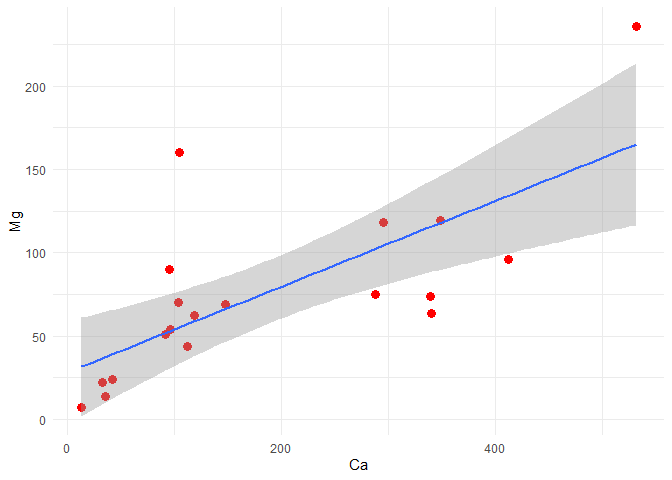

<!-- README.md is generated from README.Rmd. Please edit that file -->

# laquipedados

<!-- badges: start -->
<!-- badges: end -->

O objetivo deste repositório é servir de base para o livro
***Estatística Aplicada às Ciências Agrárias e Biológicas com R,***
fornecendo uma série de dados. Você pode baixá-los para serem usados em
determinada análise presente em um capítulo do livro. Todos esses dados
são de pesquisas próprias ou de autores que gentilmente os cederam ou
autorizaram seus usos.


## Exemplo de carregamento de dados

Você pode carregar os conjunto de daos deste pacote com os comandos
abaixo:

``` r
library(readr)
library(dplyr)
url = "https://raw.githubusercontent.com/Evaldo-Martins-STAT/laquipedados/master/"
arq <- "dados/aquifero.csv"
dados <- read_csv(paste0(url, arq), col_types = 'fdddddf')
# glimpse(dados)
```

- Exibição dos dados de sua análise

``` r
library(kableExtra)
kable(head(dados))
```

<table>
<thead>
<tr>
<th style="text-align:left;">
Amostra
</th>
<th style="text-align:right;">
HCO3
</th>
<th style="text-align:right;">
SO4
</th>
<th style="text-align:right;">
Cl
</th>
<th style="text-align:right;">
Ca
</th>
<th style="text-align:right;">
Mg
</th>
<th style="text-align:left;">
Na
</th>
</tr>
</thead>
<tbody>
<tr>
<td style="text-align:left;">
E01
</td>
<td style="text-align:right;">
10.4
</td>
<td style="text-align:right;">
30.0
</td>
<td style="text-align:right;">
967.1
</td>
<td style="text-align:right;">
95.9
</td>
<td style="text-align:right;">
53.7
</td>
<td style="text-align:left;">
857.7
</td>
</tr>
<tr>
<td style="text-align:left;">
E02
</td>
<td style="text-align:right;">
6.2
</td>
<td style="text-align:right;">
29.6
</td>
<td style="text-align:right;">
1174.9
</td>
<td style="text-align:right;">
111.7
</td>
<td style="text-align:right;">
43.9
</td>
<td style="text-align:left;">
1054.7
</td>
</tr>
<tr>
<td style="text-align:left;">
E03
</td>
<td style="text-align:right;">
2.1
</td>
<td style="text-align:right;">
11.4
</td>
<td style="text-align:right;">
2387.1
</td>
<td style="text-align:right;">
348.3
</td>
<td style="text-align:right;">
119.3
</td>
<td style="text-align:left;">
1932.4
</td>
</tr>
<tr>
<td style="text-align:left;">
E04
</td>
<td style="text-align:right;">
8.5
</td>
<td style="text-align:right;">
22.5
</td>
<td style="text-align:right;">
2186.1
</td>
<td style="text-align:right;">
339.6
</td>
<td style="text-align:right;">
73.6
</td>
<td style="text-align:left;">
1803.4
</td>
</tr>
<tr>
<td style="text-align:left;">
E05
</td>
<td style="text-align:right;">
6.7
</td>
<td style="text-align:right;">
32.8
</td>
<td style="text-align:right;">
2015.5
</td>
<td style="text-align:right;">
287.6
</td>
<td style="text-align:right;">
75.1
</td>
<td style="text-align:left;">
1691.8
</td>
</tr>
<tr>
<td style="text-align:left;">
E06
</td>
<td style="text-align:right;">
3.8
</td>
<td style="text-align:right;">
18.9
</td>
<td style="text-align:right;">
2175.8
</td>
<td style="text-align:right;">
340.4
</td>
<td style="text-align:right;">
63.8
</td>
<td style="text-align:left;">
1793.9
</td>
</tr>
</tbody>
</table>

Sempre que possível, observe os tipos de variáveis que vc está usando,
pois isso é importante para os testes estatísticos e minimizar erros
durante execução de códigos.

``` r
library(ggplot2)
dados |> ggplot(aes(x= Ca, y = Mg)) +
  geom_point(size = 3, col = "red") +
  geom_smooth(method = 'lm', formula = y~x) + theme_minimal()
```



A é um gráfico de uma Análise de Regressão Linear Simples. Deu tudo
certo.  
Agora vamos fazer de volta.  
iufuufffffffffffffffffffffffffff

rerrrrrrrrrrrrrrrrrrrrrr

errrrrrrrrrrrrrr
